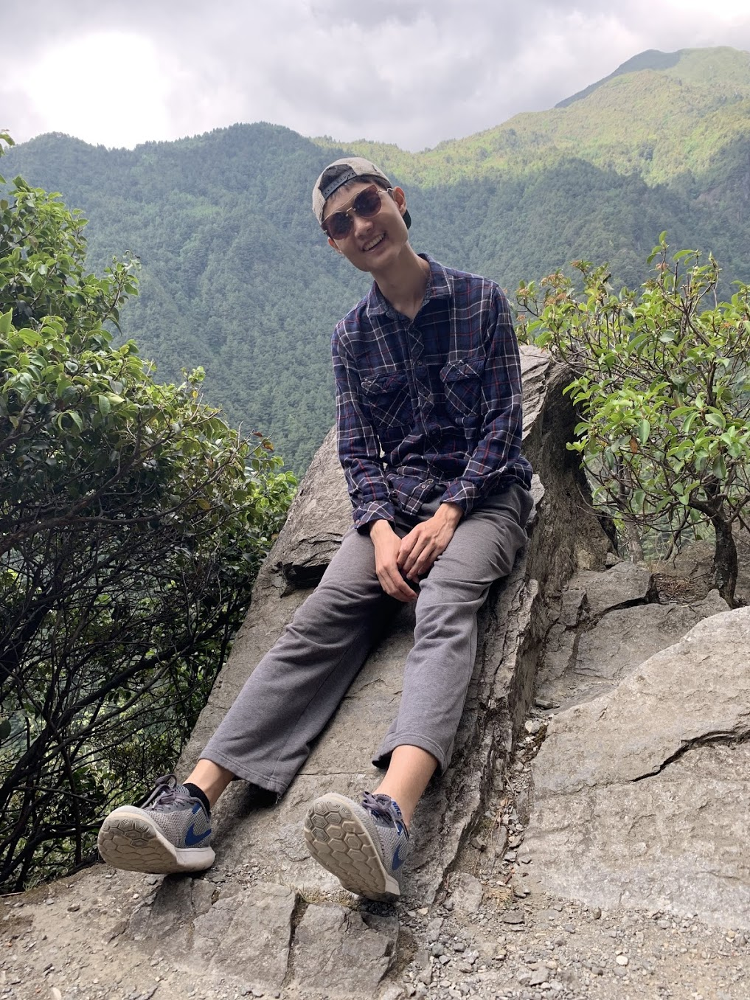

My name is Han You. I do stuffs.

Stuffs I do:
1. Algorithm stuffs
2. Random computer science stuffs, especially
  - type theory/PLT, especially Haskell witchcraft
  - distributed system
  - compiler (code generation, optimization)
3. Acoustic fingerstyle guitar stuffs
4. Outdoor stuffs: skiing, hiking & camping, road biking
5. Gaming stuffs, especially
  - City games: Cities Skyline, SimCity, Cities in Motion, etc (I have plan to make one of my own actually!)
  - Building/Planning/Managing games: Prison Architect, Rimworld, Factorio, etc
  - Paradox
